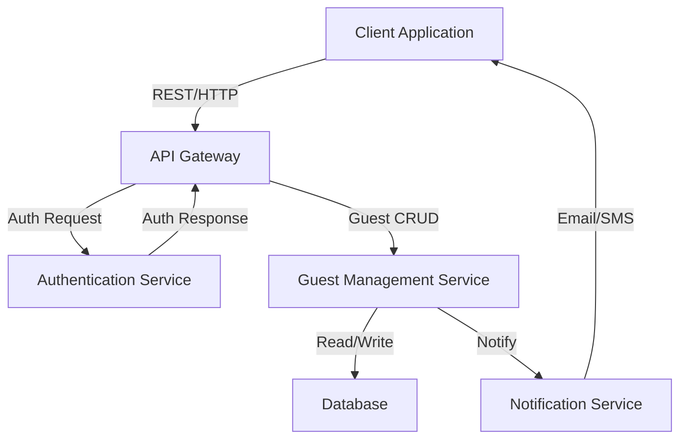

# Guests Handler Architecture Overview

Below is a Mermaid diagram illustrating the architecture overview of the `guests-handler` project.

## Description

- **Client Application**: The user interface or external service interacting with the guests-handler system.
- **API Gateway**: Entry point for all client requests, routing them to appropriate internal services.
- **Authentication Service**: Handles user authentication and authorization.
- **Guest Management Service**: Main service performing CRUD operations on guest data.
- **Database**: Stores persistent guest and user information.
- **Notification Service**: Sends notifications (e.g., email/SMS) to guests or users when necessary.

> This diagram will be upgraded as the system evolves!
